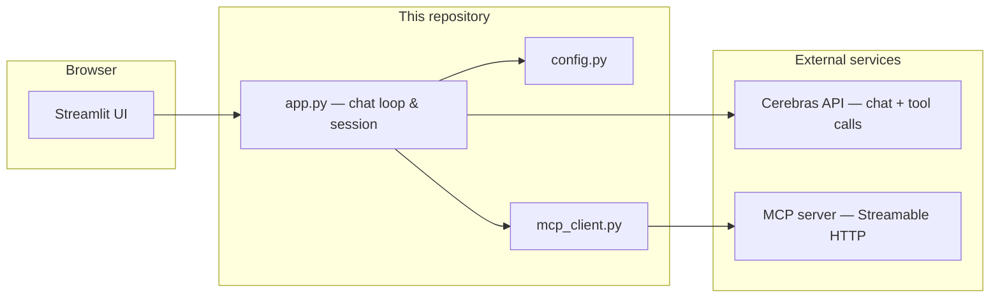

# Meridian Electronics Support

**A production-style customer-support chatbot** that pairs a **Streamlit** storefront experience with a **Cerebras** LLM and a live **Model Context Protocol (MCP)** backend for real catalogue, authentication, and order flows.

[](https://www.python.org/)
[](https://streamlit.io/)
[](https://huggingface.co/docs/hub/spaces-sdks-docker)
[](https://modelcontextprotocol.io/)

**[Open the live demo on Hugging Face Spaces](https://huggingface.co/spaces/habeneyasu/meridian-support-mcp-chatbot)** · **[Source on GitHub](https://github.com/habeneyasu/meridian-support-mcp-chatbot)**

---

## Why this project

Meridian Electronics (assessment scenario) sells monitors, keyboards, printers, and networking gear. This app shows how a **single assistant** can safely:

- answer stock questions using **live tool results**, not guesses;
- walk customers through **PIN authentication** before any order data appears;
- **place orders** only after explicit confirmation of SKU and quantity;
- stay inside **one MCP server** whose tools are **discovered at runtime** (no hard-coded tool list in code).

The UI is intentionally polished—dark theme, sidebar quick actions, and session-aware auth—so the demo feels closer to something you would ship than a notebook sketch.

---

## Capabilities

| Capability | What the user experiences | What happens under the hood |
|------------|---------------------------|------------------------------|
| **Catalogue** | Natural questions (“What monitors do you have?”) | LLM calls MCP tools such as `list_products` / `search_products`; results are summarized in plain language. |
| **Sign-in** | Email + PIN, no jargon about “tools” or JSON | `verify_customer_pin`; demo accounts use `@example.net` / `.com` / `.org` with numeric PINs. |
| **Orders** | Confirms SKU and quantity before submitting | `create_order` only after the model collects and confirms parameters. |
| **Order history** | Blocked until the customer is verified | `list_orders` / `get_order` are gated in session until authentication succeeds. |

---

## Screenshots

<p align="center">
  <b>Landing experience</b> &nbsp;·&nbsp; <b>Chat — auth & stock</b>
</p>

<p align="center">
  
  &nbsp;
  
</p>

<p align="center"><sub>Images load from GitHub <code>raw</code> so the Hugging Face Space repo stays free of large binaries per <a href="https://huggingface.co/docs/hub/xet">Hub storage policy</a>. Update the commit SHA in these URLs when you refresh UI shots.</sub></p>

---

## Architecture



- **`config.py`** — loads `.env` / process env; validates `CEREBRAS_API_KEY` at startup.
- **`mcp_client.py`** — discovers tools once, executes `call_tool` with stderr logging and friendly errors.
- **`app.py`** — Streamlit layout, Cerebras OpenAI-compatible message + tool format, auth gate, placeholder guards for demo accounts.

---

## Quick start (local)

```bash
git clone https://github.com/habeneyasu/meridian-support-mcp-chatbot.git
cd meridian-support-mcp-chatbot
python -m venv .venv && source .venv/bin/activate   # Windows: .venv\Scripts\activate
pip install -r requirements.txt
cp .env.example .env
# Edit .env: set CEREBRAS_API_KEY (required)
streamlit run app.py
```

Use `streamlit run streamlit_app.py` if your host expects the Hugging Face default entry filename.

---

## Environment

| Variable | Required | Purpose |
|----------|----------|---------|
| `CEREBRAS_API_KEY` | **Yes** | [Cerebras Cloud](https://cloud.cerebras.ai/) API key |
| `CEREBRAS_MODEL` | No | Model id (see `config.py` for default) |
| `MCP_SERVER_URL` | No | MCP endpoint; defaults to the Meridian assessment server on Cloud Run |

Never commit `.env` or paste keys into issues, chats, or screenshots.

---

## Deploy on Hugging Face Spaces

This Space uses **`sdk: docker`** and **`app_port: 8501`** (Streamlit inside a container). The YAML block at the top of this file is what Hugging Face reads for build metadata.

1. **Create** a Space with the **Docker** SDK ([new Space](https://huggingface.co/new-space)).
2. **Connect** this repository (or push these files to the Space repo).
3. **Secrets:** **Settings → Variables and secrets → New secret**  
   - Name: **`CEREBRAS_API_KEY`** (exact match)  
   - Value: your Cerebras key  
4. **Factory reboot** the Space so the running container receives the new environment.

Optional: `CEREBRAS_MODEL`, `MCP_SERVER_URL` as variables or secrets.

**Troubleshooting**

| Symptom | What to check |
|---------|----------------|
| Configuration error about `CEREBRAS_API_KEY` | Secret missing or typo; reboot after saving. |
| “Support unavailable” | MCP URL blocked or down; try default URL or check Space outbound network. |
| Default Streamlit spiral | Wrong repo or missing `streamlit_app.py` / `Dockerfile`; confirm **Build** logs use this project. |

---

## Run with Docker (local smoke test)

```bash
docker build -t meridian-support .
docker run --rm -p 8502:8501 -e CEREBRAS_API_KEY="your-key-here" meridian-support
```

Open **http://localhost:8502** (use another host port if **8501** is already taken).

---

## Spec note (Kiro assessment)

The original requirements mention Gemini / OpenAI / Anthropic “flash”-class models; this implementation uses **Cerebras** for the same class of behaviour: low-latency chat, **native function calling**, and a small Python surface area. MCP access uses the official SDK over **Streamable HTTP**; async runs in a **background thread** so Streamlit’s own runtime stays synchronous.

---

## Repository layout

| Path | Role |
|------|------|
| `app.py` | UI, prompts, LLM loop, auth and tool safety |
| `mcp_client.py` | MCP connect + `call_tool` |
| `config.py` | Environment loading and validation |
| `streamlit_app.py` | Thin entry for hosts that default to this filename |
| `Dockerfile` | Hugging Face Docker Space runtime |
| `.kiro/specs/` | Requirements, design, and task checklist |

---

<p align="center"><sub>Built for the Meridian MCP support assessment · Cerebras · Streamlit · MCP</sub></p>
